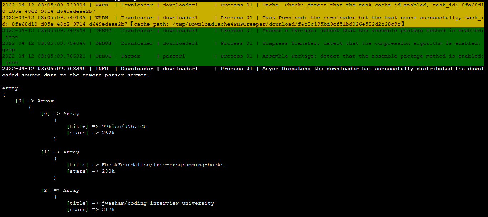
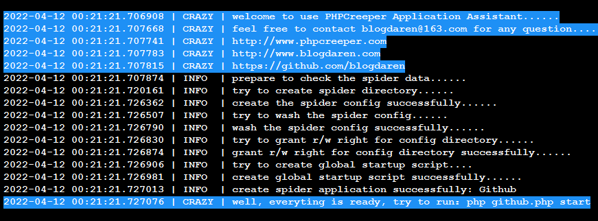

# PHPCreeper
[]()
[]()
[]()
[]()
[]()
[]()
[]()

## What is it

[PHPCreeper](http://www.phpcreeper.com) is a new generation of multi-process 
asynchronous event-driven spider engine based on [workerman](https://www.workerman.net).    

* Focus on efficient agile development, and make the crawler job become more easy   
* Solve the performance and scalability bottlenecks of traditional crawler frameworks

爬山虎是基于workerman开发的全新一代多进程异步事件驱动型PHP爬虫引擎, 它有助于我们：
* 专注于高效敏捷开发，让爬取工作变得更加简单.
* 解决传统型PHP爬虫框架的性能和扩展瓶颈问题.

## Documentation
The chinese document is relatively complete, and the english document will be kept up-to-date constantly here.   
**注意：** 爬山虎中文开发文档相对比较完善，各位小伙伴直接点击下方链接阅读即可.

* 爬山虎中文官方网站：[http://www.phpcreeper.com](http://www.phpcreeper.com)
* 中文开发文档主节点：[http://www.blogdaren.com/docs/](http://www.blogadren.com/docs/)
* 中文开发文档备节点：[http://www.phpcreeper.com/docs/](http://www.phpcreeper.com/docs/)
* **作者未涉足任何商业性资源和平台，全靠兴趣和热爱支撑，感谢你的小星星Star支持。**

## 技术交流
* 左侧绿色二维码为VX交流群：&nbsp;phpcreeper 【群主热心、有问必答、进微信群需先加此专属微信并备注：爬山虎】  
* 右侧灰色二维码为QQ交流群：1062098893【群主热心、有问必答、建议尽可能加微信群并备注群口令：爬山虎】 
* 上述两个群均围绕 [爬山虎引擎](http://www.phpcreeper.com) 和 [workerman](https://www.workerman.net/)
和 [深入PHP内核源码](https://www.bilibili.com/video/BV1pP4y1G7ae) 
开展技术交流，观看PHP内核视频请移步[B站](https://www.bilibili.com/video/BV1pP4y1G7ae)


&nbsp;&nbsp;

## Screenshot



## Features
* Inherit all features from [workerman](https://www.workerman.net)
* Free to customize various plugins and callback
* Free to customize the third-party middleware
* Support for netflow traffic limitaion
* Support for distributed deployment
* Support for separated deployment
* Support for socket programming
* Support multi-language environment
* Support for agile development with [PHPCreeper-Application](https://github.com/blogdaren/PHPCreeper-Application)
* Use PHPQuery as the elegant content extractor
* With high performance and strong scalability
* With rich and human-readable development documents 


## Prerequisites
* PHP_VERSION \>= 7.0.0     
* A POSIX compatible operating system (Linux、OSX、BSD)  
* POSIX &nbsp;extension for PHP (**required**)
* PCNTL extension for PHP (**required**)
* REDIS &nbsp;extension for PHP (optional, strongly recommend to install)
* EVENT extension for PHP (optional, better to install)
* 简单的说：只要能跑起来workerman那就能跑起来PHPCreeper，所以安装要求和workerman完全一致。
* POSIX扩展和PCNTL扩展是必选项，PHP发行包一般都会默认安装这两个扩展，若没有请自行编译安装。
* REDIS扩展和EVENT扩展是可选项，但是建议最好安装，尤其是在多worker模式下必须安装REDIS扩展。

## Installation
The recommended way to install PHPCreeper is through [Composer](https://getcomposer.org/).
```
composer require blogdaren/phpcreeper
```

## Usage: NOT Depend On The PHPCreeper Application Framework
Firstly, there is another matched Application Framework 
named [PHPCreeper-Application](https://github.com/blogdaren/PHPCreeper-Application) 
which is published simultaneously for your development convenience,
although this framework is not necessary, we strongly recommend that you use it for 
business development, thus it's no doubt that it will greatly improve your job efficiency.
However, somebody still wanna write the code which **NOT** depends on the framework, it is 
also easy to make it.   

Assume we wanna capture the github top 10 repos ranked by stars, now let's take an example to illustrate the usage:
```php
<?php 
require "./vendor/autoload.php";

use PHPCreeper\Kernel\PHPCreeper;
use PHPCreeper\Producer;
use PHPCreeper\Downloader;
use PHPCreeper\Parser;

//switch runtime language between `zh` and `en`, default is `zh`【version >= 1.3.7】
PHPCreeper::setLang('en');

//set master pid file manually if necessary 【version >= 1.3.8】
//PHPCreeper::setMasterPidFile('/path/to/master.pid');

//set worker log file when run as daemon mode if necessary 【version >= 1.3.8】
//PHPCreeper::setLogFile('/path/to/phpcreeper.log');

//uncomment the line below to enable the single worker mode so that we can run without redis,
//however you should note that you are limited to run all the downloader worker in this case.
//PHPCreeper::enableMultiWorkerMode(false); 【version >= 1.3.2】 

//start producer instance
startAppProducer();

//start downloader instance
startAppDownloader();

//start parser instance
startAppParser();

function startAppProducer()
{
    $producer = new Producer;
    $producer->setName('AppProducer')->setCount(1);
    $producer->onProducerStart = function($producer){
        //task can be configured like this, here the rule name like `r1` should be given:
        $task = array(
            'url' => array(
                "r1" => "https://github.com/search?q=stars:%3E1&s=stars&type=Repositories",
            ),
            'rule' => array(
                "r1" => array(
                    'title' => ['ul.repo-list div.f4.text-normal > a',      'text'],
                    'stars' => ['ul.repo-list div.mr-3:nth-of-typ(1) > a',  'text'],
                ),  
            ),
        );

        //task can also be configured like this, here `md5($url)` will be the rule name:
        /*$task = array(
            'url' => array(
                "https://github.com/search?q=stars:%3E1&s=stars&type=Repositories",
             ),
            'rule' => array(
                array(
                    'title' => ['ul.repo-list div.f4.text-normal > a',      'text'],
                    'stars' => ['ul.repo-list div.mr-3:nth-of-typ(1) > a',  'text'],
                ), 
            ),
        );*/

        //various context settings
        $context = array(
            //'cache_enabled'   => true,                              
            //'cache_directory' => '/tmp/DownloadCache4PHPCreeper/',
            //..........................
        );

        //we can call `createMultiTask()` for multi tasks: 
        //$producer->newTaskMan()->setContext($context)->createMultiTask($task);

        //we can also call `createTask()` for single task: 
        $producer->newTaskMan()->setUrl($task['url'])->setRule($task['rule'])->createTask();
    };
}

function startAppDownloader()
{
    $downloader = new Downloader();
    $downloader->setName('AppDownloader')->setCount(2)->setClientSocketAddress([
        'ws://127.0.0.1:8888',
    ]);

    $downloader->onBeforeDownload = function($downloader){
        //try to disable ssl verify in any of the following two ways 
        //$downloader->httpClient->disableSSL();
        //$downloader->httpClient->setOptions(['verify' => false]);
    }; 
}

function startAppParser()
{
    $parser = new Parser();
    $parser->setName('AppParser')->setCount(1)->setServerSocketAddress('websocket://0.0.0.0:8888');
    $parser->onParserExtractField = function($parser, $download_data, $fields){
        pprint($fields);
    };
}

//start phpcreeper
PHPCreeper::start();
```

## Usage: Depend On The PHPCreeper Application Framework
Now, let's do the same job based on the Application Framework:    


#### *Step-1：Download PHPCreeper-Application Framework*
```
git clone https://github.com/blogdaren/PHPCreeper-Application /path/to/myproject
```

#### *Step-2：Load the PHPCreeper Core Engine*

1、Switch to the application base directory:
```
cd /path/to/myproject
```

2、Load the PHPCreeper core engine:
```
composer require blogdaren/phpcreeper
```

#### *Step-3：Run PHPCreeper-Application Assistant*

1、Run PHPCreeper-Application assistant:
```
php  Application/Sbin/Creeper
```
2、The terminal output will look like this:    


#### *Step-4：Create One Application*
    1、Create one spider application named **github**:
    ```
    php Application/Sbin/Creeper make github --en
    ```

    2、The complete execution process looks like this:   


    As matter of fact, we have accomplished all the jobs at this point,
    you just need to run `php github.php start` to see what has happened, 
    but you still need to finish the rest step of the work if you wanna
    do some elaborate work or jobs.

#### *Step-5：Business Configuration*
    1、Switch to the application config direcory:
    ```
    cd Application/Spider/Github/Config/
    ```
    2、Edit the global config file named **global.php**:   
    ```
    Basically, there is no need to change this file unless you wanna create a new global sub-config file
    ```
    3、Edit the global sub-config file named **database.php**:
    ```php
    <?php
    return array(
            'redis' => array(
                'prefix' => 'Github',
                'host'   => '127.0.0.1',
                'port'   => 6379,
                'database' => 0,
                ),
            );
```
4、Edit the global sub-config file named **main.php**:
```php
return array(
        //set the locale, currently support Chinese and English (optional, default `zh`)
        'language' => 'en',

        //PHPCreeper has two modes to work: single worker mode and multi workers mode,   
        //the former is seldomly to use, the only advantage is that you can play it   
        //without redis-server, because it uses the PHP built-in queue service, so it    
        //only applys to some simple jobs ; the latter is frequently used to handle    
        //many more complex jobs, especially for distributed or separated work or jobs,    
        //in this way, you must enable the redis server (optional, default `true`)
        'multi_worker'  => true,

        //whether to start the given worker(s) instance or not(optional, default `true`)
        'start' => array(
            'GithubProducer'      => true,
            'GithubDownloader'    => true,
            'GithubParser'        => true,
            ),

        'task' => array(
            //set http request method (optional, default `get`)
            'method'          => 'get', 

            //set the task crawl interval, the minimum 0.001 second (optional, default `1`)
            'crawl_interval'  => 1,

            //set the max crawl depth, 0 indicates no limit (optional, default `1`)
            'max_depth'       => 1,

            //set the max number of the task queue, 0 indicates no limit (optional, default `0`)
            'max_number'      => 1000,

            //set the max number of the request for each socket connection,  
            //if the cumulative number of socket requests exceeds the max number of requests,
            //the parser will close the connection and try to reconect automatically.
            //0 indicates no limit (optional, default `0`)
            'max_request'     => 1000,

            'compress'  => array(
                //whether to enable the data compress method (optional, default `true`)
                'enabled'   =>  true,

                //compress algorithm, support `gzip` and `deflate` (optional, default `gzip`)
                'algorithm' => 'gzip',
                ),

            //limit domains which are allowed to crawl, no limit if leave empty
            'limit_domains' => array(
                    ),

            //set the initialized task url to crawl,  the value can be `string` or `array`, 
            //if configured to array, the `key` indicates the name of the rule, which is
            //corresponding to the key of the filed of `rule`, mainly used to quickly 
            //index the target data set, and we can omit the key, then phpcreeper will use
            //the `mdt($task_url)` as the default rule name
            'url' => array(
                    "r1" => "https://github.com/search?q=stars:%3E1&s=stars&type=Repositories",
                    ),

            //please refer to the "How to set extractor rule" section for details
            'rule' => array(
                    //well, don't worry, just keep empty, we will append the rule after a while
                    //"r1" => [set the business rule here], 
                    ),

            //set the context params which is compatible to guzzle for http request, because 
            //`guzzle` is the default http client, so refer to the guzzle manual if any trouble
            'context' => array(
                    //whether to enable the downlod cache or not (optional, default `false`)
                    'cache_enabled'   => false,                               

                    //set the download cache directory (optional, default is the system tmp directory)
                    'cache_directory' => '/tmp/DownloadCache4PHPCreeper/', 
                    ),
            ),
            );

```
5、Edit the business worker config file named **AppProducer.php**：
```php
<?php
return array(
        'name' => 'producer1',
        'count' => 1,
        'interval' => 1,
        );
```

6、Edit the business worker config file named **AppDownloader.php**：
```php
<?php
return array(
        'name' => 'downloader1',
        'count' => 2,
        'socket' => array(
            'client' => array(
                'parser' => array(
                    'scheme' => 'ws',
                    'host' => '127.0.0.1',
                    'port' => 8888,
                    ),
                ),
            ),
        );
```
7、Edit the business worker config file named **AppParser.php**：
```php
<?php
return array(
        'name'  => 'parser1',
        'count' => 3,
        'socket' => array(
            'server' => array(
                'scheme' => 'websocket',
                'host' => '0.0.0.0',
                'port' => 8888,
                ),
            ),
        );
```
#### *Step-6：Set Business Rule*
1、Switch to the application config directory again:
```
cd Application/Spider/Github/Config/
```
2、Edit **main.php** to append the business rules:
```php
return array(
        'task' => array(
            'url' => array(
                "r1" => "https://github.com/search?q=stars:%3E1&s=stars&type=Repositories",
                ),
            'rule' => array(
                "r1" => array(
                    'title' => ['ul.repo-list div.f4.text-normal > a',      'text'],
                    'stars' => ['ul.repo-list div.mr-3:nth-of-typ(1) > a',  'text'],
                    ), 
                ),
            ),
        );
```
#### *Step-7：Write Business Callback*
1、Write business callback for AppProducer:
    ```php
public function onProducerStart($producer)
{
    //here we can add another new task 
    //$producer->newTaskMan()->createTask($task);
    //$producer->newTaskMan()->createMultiTask($tasks);
}

public function onProducerStop($producer)
{
}

public function onProducerReload($producer)
{
}
``` 
2、Write business callback for AppDownloader:
    ```php
public function onDownloaderStart($downloader)
{
}

public function onDownloaderStop($downloader)
{
}

public function onDownloaderReload($downloader)
{
}

public function onDownloaderMessage($downloader, $parser_reply)
{
}

public function onBeforeDownload($downloader, $task)
{
    //here we can reset the $task and be sure to return it
    //$task = [...];
    //return $task;

    //here we can change the context parameters when creating a http request
    //$downloader->httpClient->setConnectTimeout(3);
    //$downloader->httpClient->setTransferTimeout(10);
    //$downloader->httpClient->setProxy('http://180.153.144.138:8800');
}

public function onStartDownload($downloader, $task)
{
}

public function onAfterDownload($downloader, $download_data, $task)
{
    //here we can save the downloaded source data to a file
    //file_put_contents("/path/to/DownloadData.txt", $download_data);
}
```
3、Write business callback for AppParser:
    ```php
public function onParserStart($parser)
{
}

public function onParserStop($parser)
{
}

public function onParerReload($parser)
{
}

public function onParerMessage($parser, $connection, $download_data)
{
    //here we can view the current task
    //pprint($parser->task);
}

public function onParserFindUrl($parser, $url)
{
    //here we can check whether the sub url is valid or not
    //if(!Tool::checkUrl($url)) return false;
}

public function onParserExtractField($parser, $download_data, $fields)
{
    //here we got the expected data successfully extracted by rule
    //!empty($fields) && pprint($fields, __METHOD__);
    pprint($fields['r1']);

    //here we can save the business data into database like mysql、redis and so on
    //DB::save($fields);
}
```
#### *Step-8：Start Application Instance*
There are two ways to start an application instance, one is `Global Startup`, 
and the other is `Single Startup`, we just need to choose one of them.
`Global Startup` means that all workers run in the same group of processes under the same application,
it can be deployed in a distributed way, but it cannot be deployed separately,
`Single Startup` means that different workers run in different groups of processes under the same application,
it can be distributed or deployed separately.

1、Or Global Startup:
```
php github.php start
```

2、Or Single Startup:
```
php Application/Spider/Github/AppProducer.php start
php Application/Spider/Github/AppDownloader.php start
php Application/Spider/Github/AppParser.php start
```

## How to set extractor rule
* Per URL config item match a unique rule config item, and the ***rule_name*** must be one-to-one correspondence
* The type of rule value must be ***Array***
* For a single task, the depth of the corresponding rule item, that is, the depth of the array, can only be 2
* For multi tasks, the depth of the corresponding rule item, that is, the depth of the array, can only be 3
```php
$urls = array(
    'rule_name1' => 'http://www.blogdaren.com';
    ...........................................;
    'rule_nameN' => 'http://www.phpcreeper.com';
);

$rule = array( 
    'rule_name1' => array(
        'field1' => ['selector', 'flag', 'range', 'callback'],
        .....................................................,
        'fieldN' => ['selector', 'flag', 'range', 'callback'],
    );
    .........................................................,
    'rule_nameN' => array(
        'field1' => ['selector', 'flag', 'range', 'callback'],
        .....................................................,
        'fieldN' => ['selector', 'flag', 'range', 'callback'],
    );
);
```

+ **rule_name**  
you should give an unique rule name for each task, so that we can easily 
extract the index data that we want, if you keep it empty, then `md5($task_url)` 
will be the unique rule name.

+ **selector**  
just like jQuery selector, its value can be like `#idName` or `.className` or `Html Element` 
and so on, besides, it also can be a regular expression depending on the value of ***flag***.

+ **flag**  
`attr`： used to get the attrbute value of html element     
　　　　【**Attention: the real value shoud be the attribute like `src`、`href` etc, NOT `attr` itself**】   
`html`： used to get the html code snippets    
`text`： used to get the text of html element    
`preg`： just a wrapper for ***preg_match()***  
`pregs`：just a wrapper for ***preg_match_all()***   

+ **range**  
used to narrow down the entries to only those that match, just like jQuery selector, 
the value can be like `#idName` or `.className` or `Html Element` and so on.

+ **callback**  
you can trigger a callback here, but remember to return the data expected.

```php
//extractor rule code example
$html = "<div><a href='http://www.phpcreeper.com' id='site' class="site">PHPCreeper</a></div>";
$rule = array(
    'link_element'  => ['div',      'html'],
    'link_text '    => ['#site',    'text'],
    'link_address'  => ['div.site', 'href'],
    'callback_data' => ['/<a .*?>(.*)<\/a>/is', 'preg', [], function($field_name, $data){
        return 'Hello ' . $data[1];
    }], 
);  
$data = $parser->extractField($html, $rule, 'rule1');
pprint($data['rule1']);

//output
Array
(
    [0] => Array
        (
            ['link_element']  => <a href="http://www.phpcreeper.com" id="site">PHPCreeper</a>
            ['link_text']     => PHPCreeper
            ['link_address']  => http://www.phpcreeper.com
            ['callback_data'] => Hello PHPCreeper
        )
)
```

## Use Database
PHPCreeper wrappers a lightweight database like Medoo style, 
please visit the [Medoo official site](https://medoo.lvtao.net/) 
if you wanna know more about its usage. now we just need to find out 
how to get the DBO, as a matter of fact, it is very simple:   

First configure the `database.php` then add the code listed below:
```php
<?php
return array(
    'dbo' => array(
        'test' => array(
            'database_type' => 'mysql',
            'database_name' => 'test',
            'server'        => '127.0.0.1',
            'username'      => 'root',
            'password'      => 'root',
            'charset'       => 'utf8'
        ),
    ),
);
```

Now we can get DBO and start the query or the other operation as you like: 
```php
$downloader->onAfterDownloader = function($downloader){
    //dbo single instance and we can pass the DSN string `test`
    $downloader->getDbo('test')->select('title', '*');
    
    //dbo single instance and we can pass the configuration array
    $config = Configurator::get('globalConfig/database/dbo/test')
    $downloader->getDbo($config)->select('title', '*');

    //dbo new instance and we can pass the DSN string `test`
    $downloader->newDbo('test')->select('title', '*');

    //dbo new instance and we can pass the configuration array
    $config = Configurator::get('globalConfig/database/dbo/test')
    $downloader->newDbo($config)->select('title', '*');
};
```

## Available commands
Note that all the commands in `PHPCreeper` can only run on the command line, 
and you must write a global entry startup script whose name
assumed to be `AppWorker.php` before you start any crawling jobs, but if you use the 
`PHPCreeper-Application` framework for your development, it will automatically 
help you generate all the startup scripts including global we need.

```
php AppWorker.php start
```

```
php AppWorker.php start -d
```

```
php AppWorker.php stop
```

```
php AppWorker.php restart
```

```
php AppWorker.php reload
```

```
php AppWorker.php reload -g
```

```
php AppWorker.php status
```

```
php AppWorker.php connections
```

## Related links and thanks

* [http://www.phpcreeper.com](http://www.phpcreeper.com)
* [http://www.blogdaren.com](http://www.blogdaren.com)
* [https://www.workerman.net](https://www.workerman.net)

## Donate
As a free worker, if you think [PHPCreeper](http://www.phpcreeper.com) is valuable to you and benefit from it, 
I'm willing to accept donations from all sides. Thanks a lot.

* By PayPal.me：[PHPCcreeper.paypal.me](https://paypal.me/phpcreeper)
* By Alipay or Wechat：    

&nbsp;&nbsp;&nbsp;&nbsp;


## LICENSE
[PHPCreeper](http://www.phpcreeper.com) is released under the [Apache 2.0 License](http://www.apache.org/licenses/LICENSE-2.0).   

## DISCLAIMER
Please **DON'T** use PHPCreeper for businesses which are **NOT PERMITTED BY LAW** in your country. 
If you break the law, you need to take responsibility for that.

## 协议变更
为什么协议由MIT暂变更为Apache 2.0：    
【1】[http://www.blogdaren.com/post-2601.html](http://www.blogdaren.com/post-2601.html)   
【2】[https://www.v2ex.com/t/689365](https://www.v2ex.com/t/689365)

## 友情链接
* 感谢workerman官方：[workerman](https://www.workerman.net)
* 协程版workerman：[WarriorMan](https://github.com/zyfei/WarriorMan)


