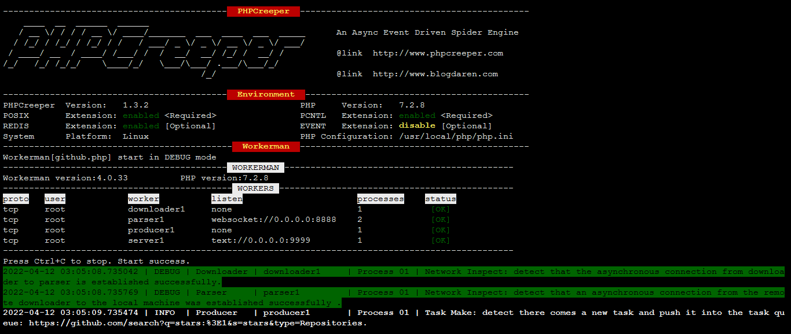
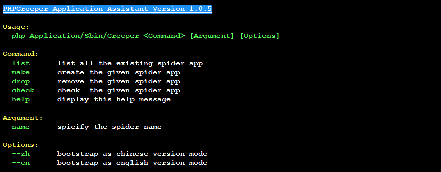

# PHPCreeper
[]()
[]()
[]()
[]()
[]()
[]()
[]()

## What is it

[PHPCreeper](http://www.phpcreeper.com) is a new generation of multi-process 
asynchronous event-driven spider engine based on [Workerman](https://www.workerman.net).    

* Focus on efficient agile development, and make the crawler job become more easy   
* Solve the performance and scalability bottlenecks of traditional crawler frameworks

爬山虎是基于workerman开发的全新一代多进程异步事件驱动型PHP爬虫引擎, 它有助于我们：
* 专注于高效敏捷开发，让爬取工作变得更加简单.
* 解决传统型PHP爬虫框架的性能和扩展瓶颈问题.

## Documentation
The chinese document is relatively complete, and the english document will be kept up-to-date constantly here.   
**注意：** 爬山虎中文开发文档相对比较完善，各位小伙伴直接点击下方链接阅读即可.

* 爬山虎中文官方网站：[http://www.phpcreeper.com](http://www.phpcreeper.com)
* 中文开发文档主节点：[http://www.blogdaren.com/docs/](http://www.blogadren.com/docs/)
* 中文开发文档备节点：[http://www.phpcreeper.com/docs/](http://www.phpcreeper.com/docs/)
* **作者未涉足任何商业性资源和平台，全靠兴趣和热爱支撑，文档访问速度慢没办法，尽力了。**

## 技术交流
* 左侧绿色二维码为VX交流群：&nbsp;phpcreeper 【想进微信群的请先加此专属微信并备注：入群】  
* 右侧灰色二维码为QQ交流群：1062098893【群主热心、有问必答、入群口令：phpcreeper】 
* 上述两个群均围绕 [爬山虎引擎](http://www.phpcreeper.com) 和 [深入PHP内核源码](https://www.bilibili.com/video/BV1pP4y1G7ae) 
技术交流，观看PHP内核视频请移步[B站](https://www.bilibili.com/video/BV1pP4y1G7ae)


&nbsp;&nbsp;

## Screenshot



## Features
* Inherit all features from [Workerman](https://www.workerman.net)
* Free to customize various plugins and callback
* Free to customize the third-party middleware
* Support for netflow traffic limitaion
* Support for distributed deployment
* Support for separated deployment
* Support for socket programming
* Support multi-language environment
* Support for agile development with [PHPCreeper-Application](https://github.com/blogdaren/PHPCreeper-Application)
* Use PHPQuery as the elegant content extractor
* With high performance and strong scalability
* With rich and human-readable development documents 


## Prerequisites
* PHP_VERSION \>= 7.0.0     
* A POSIX compatible operating system (Linux、OSX、BSD)  
* POSIX &nbsp;extension for PHP (**required**)
* PCNTL extension for PHP (**required**)
* REDIS &nbsp;extension for PHP (optional, strongly recommend to install)
* EVENT extension for PHP (optional, better to install)

## Installation
The recommended way to install PHPCreeper is through [Composer](https://getcomposer.org/).
```
composer require blogdaren/phpcreeper
```

## Usage: NOT Depend On The PHPCreeper Application Framework
Firstly, we should know there is another official matched application framework 
named [PHPCreeper-Application](https://github.com/blogdaren/PHPCreeper-Application) 
which is published simultaneously for your development convenience,
although this framework is not necessary, we strongly recommend that you use it for 
business development, thus it's no doubt that it will greatly improve your job efficiency.
However, somebody still wanna write the code which **NOT** depends on the framework, it is 
also easy to make it.   

Assume we wanna capture the weather forecasts for the next 7 days, now let's take an example to illustrate the usage:
```php
<?php 
require "./vendor/autoload.php";

use PHPCreeper\Kernel\PHPCreeper;
use PHPCreeper\Producer;
use PHPCreeper\Downloader;
use PHPCreeper\Parser;

//uncomment the line below to enable the single worker mode so that we can paly without redis,
//however, you should note that you can only run all the downloader worker in this case.
//PHPCreeper::$isRunAsMultiWorker = false;  
//PHPCreeper::enableMultiWorkerMode(false); 【version >= 1.3.2】 

//producer instance
$producer = new Producer;
$producer->setName('AppProducer')->setCount(1);
$producer->onProducerStart = function($producer){
    //task can be configured like this, here the rule name like `r1` should be given:
    $task = array(
        'url' => array(
            "r1" => "http://www.weather.com.cn/weather/101010100.shtml",
        ),
        'rule' => array(
            "r1" => array(
                'time' => ['div#7d ul.t.clearfix h1',      'text'],
                'wea'  => ['div#7d ul.t.clearfix p.wea',   'text'],
                'tem'  => ['div#7d ul.t.clearfix p.tem',   'text'],
                'wind' => ['div#7d ul.t.clearfix p.win i', 'text'],
            ), 
        ),
    );

    //task can also be configured like this, here `md5($url)` will be the rule name:
    $task = array(
        'url' => array(
            "http://www.weather.com.cn/weather/101010100.shtml",
        ),
        'rule' => array(
            array(
                'time' => ['div#7d ul.t.clearfix h1',      'text'],
                'wea'  => ['div#7d ul.t.clearfix p.wea',   'text'],
                'tem'  => ['div#7d ul.t.clearfix p.tem',   'text'],
                'wind' => ['div#7d ul.t.clearfix p.win i', 'text'],
            ), 
        ),
    );

    //various context settings
    $context = array(
        //'cache_enabled'   => true,                              
        //'cache_directory' => '/tmp/task/download/' . date('Ymd'), 
        //..........................
    );

    //we can call `createMultiTask()` for multi tasks: 
    $producer->newTaskMan()->setContext($context)->createMultiTask($task);

    //we can also call `createTask()` for single task: 
    $producer->newTaskMan()->setUrl($task['url'])->setRule($task['rule'])->createTask();
};

//downloader instance
$downloader = new Downloader();
$downloader->setName('AppDownloader')->setCount(2)->setClientSocketAddress([
    'ws://127.0.0.1:8888',
]);

//parser instance
$parser = new Parser();
$parser->setName('AppParser')->setCount(1)->setServerSocketAddress('websocket://0.0.0.0:8888');
$parser->onParserExtractField = function($parser, $download_data, $fields){
    pprint($fields);
};

//start phpcreeper
PHPCreeper::start();
```

## Usage: Depend On The PHPCreeper Application Framework
Next, let's use the official application framework to complete the same task above efficiently:    


#### *Step-1：Download PHPCreeper-Application Framework*
```php
git clone https://github.com/blogdaren/PHPCreeper-Application /path/to/myproject
```

#### *Step-2：Load the PHPCreeper Core Engine*

1、Switch to the application base directory:
```php
cd /path/to/myproject
```

2、Load the PHPCreeper core engine:
```php
composer require blogdaren/phpcreeper
```

#### *Step-3：Run PHPCreeper-Application Assistant*

1、Run PHPCreeper-Application assistant:
```php
php  Application/Sbin/Creeper

```
2、The terminal output will look like this:    



 #### *Step-4：Create One Application*
1、Create one spider application named **weather**:
```
php Application/Sbin/Creeper make weather --en
```
2、The full process of building looks like this:   


As matter of fact, we have accomplished all the jobs at this point,
you just need to run `php weather.php start` to see what has happened, 
but you still need to finish the rest step of the work if you wanna
do some elaborate work or jobs.

#### *Step-5：Business Configuration*
1、Switch to the application config direcory:
```
cd Application/Spider/Weather/Config/
```
2、Edit the global config file named **global.php**:   
```
ATTENTION: don't change this file unless you want to introduce a new global sub-config file
```
3、Edit the global sub-config file named **database.php** like this:
```php
<?php
return array(
    'redis' => array(
        'prefix' => 'Weather',
        'host'   => '127.0.0.1',
        'port'   => 6379,
        'database' => 0,
    ),
);
```
4、Edit the global sub-config file named **main.php** like this:
```php
return array(
    //set the locale, currently support Chinese and English (optional, default `zh`)
    'language' => 'en',

    //phpcreeper has two modes to work: single worker mode and multi workers mode
    //the former is seldomly to use, only applys to some simple jobs, now you have 
    //the chance to use the built-in php queue service without redis; the latter 
    //is frequently to use to handle many more complex jobs, especially distributed,
    //in this way, you must enable the redis server (optional, default `true`)
    'multi_worker'  => true,

    //whether to boot any worker instance you want (optional, default `true`)
    'start' => array(
        'WeatherProducer'      => true,
        'WeatherDownloader'    => true,
        'WeatherParser'        => true,
    ),

    'task' => array(
        //set http request method (optional, default `get`)
        'method'          => 'get', 

        //set the task crawl interval, the minimum 0.001 second (optional, default `1`)
        'crawl_interval'  => 1,

        //set the max crawl depth, 0 indicates no limit (optional, default `1`)
        'max_depth'       => 1,

        //set the max number of the task queue, 0 indicates no limit (optional, default `0`)
        'max_number'      => 1000,

        //set the max number of the request for each socket connection,  
        //if the cumulative number of socket requests exceeds the max number of requests,
        //the parser will close the connection and try to reconect automatically.
        //0 indicates no limit (optional, default `0`)
        'max_request'     => 1000,

        'compress'  => array(
            //whether to enable the data compress method (optional, default `true`)
            'enabled'   =>  true,

            //compress algorithm, support `gzip` and `deflate` (optional, default `gzip`)
            'algorithm' => 'gzip',
        ),

        //limit domains which are allowed to crawl, no limit if leave empty
        'limit_domains' => array(
        ),

        //set the initialized task url to crawl,  the value can be `string` or `array`, 
        //if configured to array, the `key` indicates the name of the rule, which is
        //corresponding to the key of the filed of `rule`, mainly used to quickly 
        //index the target data set, and we can omit the key, then phpcreeper will use
        //the `mdt($task_url)` as the default rule name
        'url' => array(
            "r1" => "http://www.weather.com.cn/weather/101010100.shtml",
        ),

        //please refer to the "How to set extractor rule" section for details
        'rule' => array(
            //"r1"    => [set the business rule here], 
            //"r2"    => [set the business rule here], 
            //[set the business rule here], 
        ),

        //set the context params which is compatible to guzzle for http request, cuz `guzzle`
        //is the default http client, so reference to the guzzle manual if any trouble
        'context' => array(
            //whether to enable the downlod cache (optional, default `false`)
            'cache_enabled'   => false,                               

            //set the download cache directory (optional, default is the system tmp directory)
            'cache_directory' => '/tmp/task/download/' . date('Ymd'), 
        ),
   ),
);
```
In fact, most of the configuration parameters are not used frequently, it will read the 
default value from engine automatically, so the configuration can be simplified like this:
```
return array(
    'task' => array(
        'url' => array(
            "r1" => "http://www.weather.com.cn/weather/101010100.shtml",
        ),
    ),
);
```
5、Edit the business worker config file named **AppProducer.php** like this：
```
<?php
return array(
    'name' => 'producer1',
    'count' => 1,
    'interval' => 1,
);
```
6、Edit the business worker config file named **AppDownloader.php** like this：
```php
<?php
return array(
    'name' => 'downloader1',
    'count' => 2,
    'socket' => array(
        'client' => array(
            'parser' => array(
                'scheme' => 'ws',
                'host' => '127.0.0.1',
                'port' => 8888,
            ),
        ),
    ),
    'cache' => array(
        'enabled'   => false,
        'directory' => '/tmp/logs/data/' . date('Ymd'),
    ),
);
```
7、Edit the business worker config file named **AppParser.php** like this：
```php
<?php
return array(
    'name'  => 'parser1',
    'count' => 3,
    'socket' => array(
        'server' => array(
            'scheme' => 'websocket',
            'host' => '0.0.0.0',
            'port' => 8888,
        ),
    ),
);
```
#### *Step-6：Set Business Rule*
1、Switch to the PHPCreeper-Application base directory again:
```
cd Application/Spider/Weather/Config/
```
2、Go back to Edit **main.php** again:
```php
return array(
    'task' => array(
        'url' => array(
            "r1" => "http://www.weather.com.cn/weather/101010100.shtml",
        ),
        'rule' => array(
            "r1" => array(
                'time' => ['div#7d ul.t.clearfix h1',      'text'],
                'wea'  => ['div#7d ul.t.clearfix p.wea',   'text'],
                'tem'  => ['div#7d ul.t.clearfix p.tem',   'text'],
                'wind' => ['div#7d ul.t.clearfix p.win i', 'text'],
            ), 
        ),
   ),
);
```
#### *Step-7：Write Business Callback*
1、Write business callback for AppProducer:
```php
public function onProducerStart($producer)
{
    //here we can add another new task 
    /*$task = array(
         'url' => array(
             'r1' => 'https://baike.baidu.com/item/%E5%8C%97%E4%BA%AC/128981?fr=aladdin',
         ),
         'rule' => array(
             'r1' => array(
                 'airport' => ['dl.basicInfo-right dd.basicInfo-item.value:eq(5)', 'text'],
             ),
         ),
    );
    $producer->newTaskMan()->createMultiTask($task);*/
}

public function onProducerStop($producer)
{
}

public function onProducerReload($producer)
{
}
``` 
2、Write business callback for AppDownloader:
```php
public function onDownloaderStart($downloader)
{
}

public function onDownloaderStop($downloader)
{
}

public function onDownloaderReload($downloader)
{
}

public function onDownloaderMessage($downloader, $parser_reply)
{
}

public function onBeforeDownload($downloader, $task)
{
    //here we can reset the $task array here and be sure to return it
    //$task = [...];
    //return $task;

    //here we can change the context parameters when making a http request
    //$downloader->httpClient->setConnectTimeout(3);
    //$downloader->httpClient->setTransferTimeout(10);
    //$downloader->httpClient->setProxy('http://180.153.144.138:8800');
}

public function onStartDownload($downloader, $task)
{
}

public function onAfterDownload($downloader, $download_data, $task)
{
    //here we can save the downloaded source data to a file
    //file_put_contents("/path/to/downloadData.txt", $download_data);
}
```
3、Write business callback for AppParser:
```
public function onParserStart($parser)
{
}

public function onParserStop($parser)
{
}

public function onParerReload($parser)
{
}

public function onParerMessage($parser, $connection, $download_data)
{
    //we can still view the current task entity 
    //pprint($parser->task);
}

public function onParserFindUrl($parser, $url)
{
    //here we can check whether the sub url is valid or not
    //if(!Tool::checkUrl($url)) return false;
}

public function onParserExtractField($parser, $download_data, $fields)
{
    //here we can print out the business data extracted by rule
    //!empty($fields) && var_dump($fields, __METHOD__);

    //here we can save the business data into database like mysql、redis and so on
    //DB::save($fields);
}
```
#### *Step-8：Start Application Instance*
There are two ways to start an application instance, one is `Global Startup`, 
and the other is `Single Startup`, we just need to choose one of them.
`Global Startup` means that all workers run in the same group of processes under the same application,
it can be deployed in a distributed way, but it cannot be deployed separately,
`Single Startup` means that different workers run in different groups of processes under the same application,
it can be distributed or deployed separately.

1、Or Global Startup:
```
php weather.php start
```

2、Or Single Startup:
```
php Application/Spider/Weather/AppProducer.php start
php Application/Spider/Weather/AppDownloader.php start
php Application/Spider/Weather/AppParser.php start
```

## How to set extractor rule
* Per URL config item match a unique rule config item, and the ***rule_name*** must be one-to-one correspondence
* The type of rule value must be ***Array***
* For a single task, the depth of the corresponding rule item, that is, the depth of the array, can only be 2
* For multi tasks, the depth of the corresponding rule item, that is, the depth of the array, can only be 3
```php
$urls = array(
    'rule_name1' => 'http://www.blogdaren.com';
    ...........................................;
    'rule_nameN' => 'http://www.phpcreeper.com';
);

$rule = array( 
    'rule_name1' => array(
        'field1' => ['selector', 'flag', 'range', 'callback'],
        .....................................................,
        'fieldN' => ['selector', 'flag', 'range', 'callback'],
    );
    .........................................................,
    'rule_nameN' => array(
        'field1' => ['selector', 'flag', 'range', 'callback'],
        .....................................................,
        'fieldN' => ['selector', 'flag', 'range', 'callback'],
    );
);
```

+ **rule_name**  
you should give an unique rule name for each task, so that we can easily 
extract the index data that we want, if you keep it empty, then `md5($task_url)` 
will be the unique rule name.

+ **selector**  
just like jQuery selector, its value can be like `#idName` or `.className` or `Html Element` 
and so on, besides, it also can be a regular expression depending on the value of ***flag***.

+ **flag**  
`attr`： used to get the attrbute value of html element     
　　　　【**Attention: the real value shoud be the attribute like `src`、`href` etc, NOT `attr` itself**】   
`html`： used to get the html code snippets    
`text`： used to get the text of html element    
`preg`： just a wrapper for ***preg_match()***  
`pregs`：just a wrapper for ***preg_match_all()***   

+ **range**  
used to narrow down the entries to only those that match, just like jQuery selector, 
the value can be like `#idName` or `.className` or `Html Element` and so on.

+ **callback**  
you can trigger a callback here, but remember to return the data expected.

```php
//extractor rule code example
$html = "<div><a href='http://www.phpcreeper.com' id='site' class="site">PHPCreeper</a></div>";
$rule = array(
    'link_element'  => ['div',      'html'],
    'link_text '    => ['#site',    'text'],
    'link_address'  => ['div.site', 'href'],
    'callback_data' => ['/<a .*?>(.*)<\/a>/is', 'preg', [], function($field_name, $data){
        return 'Hello ' . $data[1];
    }], 
);  
$data = $parser->extractField($html, $rule, 'rule1');
pprint($data['rule1']);

//output
Array
(
    [0] => Array
        (
            ['link_element']  => <a href="http://www.phpcreeper.com" id="site">PHPCreeper</a>
            ['link_text']     => PHPCreeper
            ['link_address']  => http://www.phpcreeper.com
            ['callback_data'] => Hello PHPCreeper
        )
)
```

## Use Database
PHPCreeper wrappers a lightweight database like Medoo style, 
please visit the [Medoo official site](https://medoo.lvtao.net/) 
if you wanna know more about its usage. now we just need to find out 
how to get the DBO, as a matter of fact, it is very simple:   

First configure the `database.php` then add the code belowed:
```php
<?php
return array(
    'dbo' => array(
        'test' => array(
            'database_type' => 'mysql',
            'database_name' => 'test',
            'server'        => '127.0.0.1',
            'username'      => 'root',
            'password'      => 'root',
            'charset'       => 'utf8'
        ),
    ),
);
```

Now we can get DBO and start the query or the other operation as you like: 
```php
$downloader->onAfterDownloader = function($downloader){
    //dbo single instance and we can pass the DSN string `test`
    $downloader->getDbo('test')->select('user', '*');
    
    //dbo single instance and we can pass the configuration array
    $config = Configurator::get('globalConfig/database/dbo/test')
    $downloader->getDbo($config)->select('user', '*');

    //dbo new instance and we can pass the DSN string `test`
    $downloader->newDbo('test')->select('user', '*');

    //dbo new instance and we can pass the configuration array
    $config = Configurator::get('globalConfig/database/dbo/test')
    $downloader->newDbo($config)->select('user', '*');
};
```

## Available commands
We have to remind you again that all the commands in `PHPCreeper` can only run on the command line, 
and whatever the application is, you must write an entry startup script whose name
assumed to be `AppWorker.php` before you start PHPCreeper, but if you use the 
`PHPCreeper-Application` framework for development, the framework will automatically 
generate the application entry startup script.

1、Start as debug mode:   
```
php AppWorker.php start
```

2、Start as daemon mode:   
```
php AppWorker.php start -d
```

3、Stop:
```
php AppWorker.php stop
```

4、Restart:
```
php AppWorker.php restart
```

5、Reload one by one:
```
php AppWorker.php reload
```

6、Reload gracefully:
```
php AppWorker.php reload -g
```

7、Show runtime status:
```
php AppWorker.php status
```

8、Show connections status:
```
php AppWorker.php connections
```

## Related links and thanks

* [http://www.phpcreeper.com](http://www.phpcreeper.com)
* [http://www.blogdaren.com](http://www.blogdaren.com)
* [https://www.workerman.net](https://www.workerman.net)

## Donate
As a free worker, if you think [PHPCreeper](http://www.phpcreeper.com) is valuable to you and benefit from it, 
I'm willing to accept donations from all sides. Thanks a lot.

* By PayPal.me：[PHPCcreeper.paypal.me](https://paypal.me/phpcreeper)
* By Alipay or Wechat：    


## LICENSE
[PHPCreeper](http://www.phpcreeper.com) is released under the [Apache 2.0 License](http://www.apache.org/licenses/LICENSE-2.0).   

## DISCLAIMER
Please **DON'T** use PHPCreeper for businesses which are **NOT PERMITTED BY LAW** in your country. 
If you break the law, you need to take responsibility for that.

## 协议变更
为什么协议由MIT暂变更为Apache 2.0：    
【1】[http://www.blogdaren.com/post-2601.html](http://www.blogdaren.com/post-2601.html)   
【2】[https://www.v2ex.com/t/689365](https://www.v2ex.com/t/689365)

## 友情链接
[WarriorMan：协程版workerman](https://github.com/zyfei/WarriorMan)


